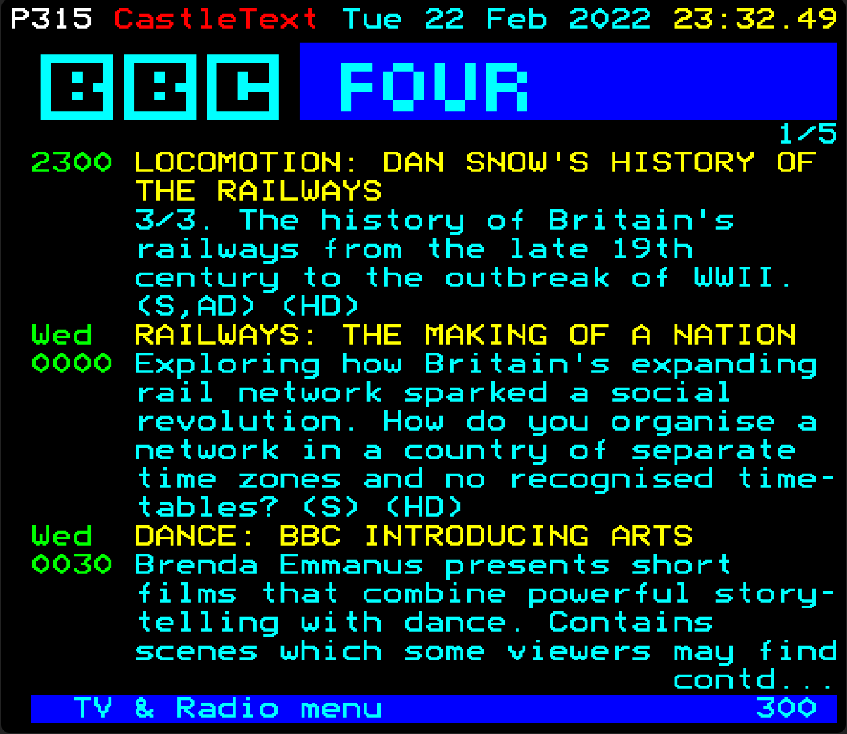

# castletext

RSS to Teletext server with bundled web viewer based on edit.tf



How the long Covid-19 lockdown evenings fly by... 😉

This project serves teletext frames in BBC Micro Mode 7 display RAM format to a separate BBC Basic client I wrote
which uses [Robert Sprowson's BBC Master 128 Ethernet module](http://www.sprow.co.uk/bbc/masternet.htm) to request frames over HTTP.

However, I also added a browser-based viewer I crudely cobbled together from Simon Rawles' superb [edit.tf](https://github.com/rawles/edit.tf) so that you can view the teletext in your modern web browser too.

Some frames are hardcoded menu frames, others are generated from one of several RSS feeds or the article pages those
link off to.

The server can also talk to [TV Headend](https://tvheadend.org/) to generate TV & Radio listings pages.

## Getting the code

To get the server code onto your machine using Linux or macOS:

```
git clone git@github.com:webmariner/castletext.git
cd castletext
```

## Enabling the TV Listings pages

If you use TV Headend, you can update the channel pages JSON file with the URL and credentials of your TVH server and your channel IDs to match the channel names. Then uncomment the fetchListings call in the fetchThings() function in index.js. If you want to use different channels, you would also need to update the static frame for the listings menu page.

## Running the server

You can run the server locally if you either have node.js installed or if you have an application container tool like [Podman](http://docs.podman.io/en/latest/) or Docker installed. Running it as a container means you won't have to worry about what version of node you have installed or any possible compatibility issues with the libraries I've used. On the other hand, if you already have node installed or want to use it for other things too, then you can probably save yourself some downloads 😉

Once you've decided whether to use node or a container tool to run it, on Linux you can use your usual package manager like apt or yum to install one or the other. On macOS the fabulous [Homebrew](https://brew.sh/) will do the trick with either `brew install node` or `brew cask install podman`.

### Running on Node.js directly

To run it using the node/npm installation on your machine:

```
npm install
node index.js
```

then point your web browser to localhost:1700

### Running as a container

If you'd rather run the server in container form, thanks to [Bruce James](https://github.com/CygnusAlpha)' suggestion I've added a container file. You will need to build the container image and then run it (fire up an instance of the image). For those using podman:

```
podman build -t webmariner.uk/castletext .
podman run -p 1700:1700 -it castletext
```

For those using Docker, I believe replacing 'podman' with 'docker' in the above commands should still work.

## Meta-news

In June 2020, sadly Reuters decided to switch off their RSS feeds. Hat tip to Artem Bugara for [his article about Google's RSS query service](https://codarium.substack.com/p/returning-the-killed-rss-of-reuters). The Oddly Enough feed will be missed, at least until I write a scraper to replace it ;) You could use something like [RSS app](https://rss.app/) to generate feeds for content you want that doesn't have a feed, though you would need to create an account.

## Disclaimer

The code comes with no warranties etc. 😉 (released under GPL-3.0 Licence). I should probably mention that this server should be for personal use only - not because of any rights in my code but the rights in the content it fetches. To run a public-facing instance might be deemed retransmission or passing off from a copyright perspective unless you agree it with the rights holders of the news feeds first. If it's just for you and your dawg then it's effectively just a fancy web browser.
